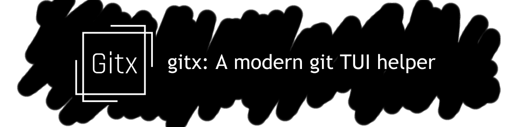

# 🖥️ gitx

   

A powerful Terminal User Interface (TUI) for Git that makes version control more accessible and efficient.

<!--  -->

## ✨ Features

-   📂 **Interactive Repository Navigation**: Easily browse your repository structure
-   📊 **Visual Commit History**: See your project history at a glance
-   🔍 **Intuitive Diff Viewer**: Understand changes with clear visual diffs
-   🌿 **Branch Management**: Create, switch, and manage branches effortlessly
-   ⌨️ **Keyboard-Driven Workflow**: Optimized for keyboard shortcuts
-   🚀 **Fast and Responsive**: Built for speed with minimal resource usage

<!-- TODO: Add Quick Start Section once packaging is enabled -->

## 📚 Documentation

Refer our [comprehensive documentation](https://gitxtui.github.io/gitx/) for:

-   [Installation Guide](https://gitxtui.github.io/gitx/installation/)
-   [Getting Started](https://gitxtui.github.io/gitx/usage/getting-started/)
-   [Tutorials](https://gitxtui.github.io/gitx/tutorial/introduction/)
-   [Contributing Guidelines](https://gitxtui.github.io/gitx/contributing/guidelines/)

## 🧩 Project Status

This project is currently in active development. We welcome contributions!

## 📄 License

[MIT License](LICENSE)
